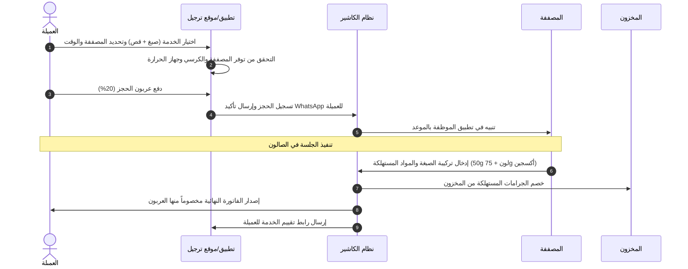

# وثيقة متطلبات المنتج (PRD) - منصة "تَرجيل" (Tarjeel)
## النظام السحابي الشامل لإدارة صالونات التجميل والكوافيرات ومراكز العناية

---

### 1. الهوية والاسم التراثي (Brand Identity & Etymology)

- **الاسم:** تَرجيل (Tarjeel).
- **الأصل اللغوي التراثي:** جاء في *لسان العرب* لابن منظور: «رَجَّلَ شَعَرَهُ يَرْجُلُهُ رَجْلاً وتَرْجِيلاً: سَرَّحَهُ وحَسَّنَهُ وَزَيَّنَهُ، ومَشَطَهُ ودَهَنَهُ». وهو أصل عربي قديم دقيق يصف العناية بالشعر والمظهر وحسن التنسيق.
- **الشعار اللفظي:** دقة المواعيد، وإتقان التجميل، وإدارة بلا هدر.

---

### 2. الملخص التنفيذي والمشكلة السوقية (Executive Summary & Problem Statement)

#### 2.1 المشكلة
- **إهدار الوقت والازدحام:** فترات انتظار طويلة للعميلات بسبب سوء جدولة المواعيد وتداخل حجوزات المصففات.
- **تغيب العميلات بدون إشعار (No-shows):** يكلف الصالونات ما بين 15% إلى 25% من إجمالي الدخل الشهري.
- **تسريب المخزون:** استهلاك عشوائي لمنتجات المعالجة والصبغات ومستحضرات العناية دون ربط دقيق بالخدمات المنفذة.
- **تعقيد حساب العمولات:** صعوبة حساب نسب المصففات ومساعداتهن ومبيعات التجزئة والإكراميات (Tips) بدقة.
- **غياب التاريخ الجمالي للعميلة:** ضياع تفاصيل خلطات الصبغ السابقة، والحساسية من مواد معينة، والخدمات المفضلة.

#### 2.2 القيمة المضافة (Value Proposition)
منصة "تَرجيل" هي نظام SaaS متكامل يربط حجز العميلات عبر تطبيق وموقع مخصص لكل صالون، مع نظام إدارة داخلي (POS/ERP) يدير الكراسي، وجدول الموظفات بدقة الدقائق مع فترات تعقيم بينية، وتتبع مخزون المواد الخام بالجرام، ومحرك عمولات تلقائي، وبطاقة عميلة رقمية تحفظ التركيبات والصور المرجعية.

---

### 3. تحليل السوق وأفضل الممارسات العالمية (Benchmark & Researched Best Features)

استناداً إلى دراسة رواد المجال (مثل Fresha, Boulevard, Zenoti, Vagaro)، يتضمن "تَرجيل" الميزات الأحدث عالمياً:
1. **الجدولة الذكية القائمة على الكراسي والأجهزة (Resource-Based Scheduling):** الحجز لا يربط العميلة بالمصففة فقط، بل يحجز كرسي غسيل الشعر أو جهاز الفيلر لتفادي التعارض.
2. **محرك حماية الإيرادات (No-Show Protection):** اشتراط دفع عربون مسبق أو حجز بطاقة ائتمانية، مع سياسة إلغاء متدرجة.
3. **تتبع تركيبة الصبغة (Color Formula Archiving):** تصوير النتيجة وتسجيل نسب خلط الألوان وماركة الصبغة وتاريخ الجلسة.
4. **تتبع استهلاك المواد بالجرام (Backbar Inventory Deduction):** خصم كمية المواد المستهلكة في الخدمة من المخزون المركزي فور إتمام الفاتورة.
5. **تذكير ذكي وتأكيد عبر WhatsApp:** إرسال رابط تأكيد بضغطة واحدة قبل الموعد بـ 24 ساعة وساعتين.

---

### 4. شرائح المستخدمين ورحلات الاستخدام (User Personas & Journeys)

#### 4.1 الأدوار (Roles)
- **العميلة (Client):** تتصفح الخدمات، تختار المصففة المفضلة، تحجز الموعد وتدفع العربون.
- **المصففة/الأخصائية (Stylist/Staff):** تستعرض جدول مواعيدها اليومي، تسجل المستحضرات المستخدمة، وتتابع عمولاتها.
- **موظفة الاستقبال (Receptionist):** إدارة الحضور الفوري (Walk-ins)، تأكيد الحجوزات، وتحصيل الفواتير على الكاشير.
- **مالك/مدير الصالون (Salon Owner/Manager):** إدارة الأسعار، مراقبة المخزون، تقارير الأداء والأرباح.

#### 4.2 رحلة المستخدم الرئيسية (Main User Journey)


---

### 5. المتطلبات الوظيفية المفصلة (Functional Requirements - MoSCoW)

#### 5.1 المتطلبات الإلزامية (Must Have - MVP)
- **محرك الحجوزات والتقويم:**
  - عرض جدول المواعيد بتقسيمات زمنية مرنة (15/30/45 دقيقة).
  - تحديد فترات تنظيف وتعقيم إلزامية (Buffer Time) بين المواعيد.
  - إمكانية حجز باقات خدمات متعددة في زيارة واحدة مع حساب تتابع الخطوات.
- **نظام نقاط البيع (POS) والفواتير:**
  - فواتير إلكترونية متوافقة مع متطلبات الضرائب والفاتورة الإلكترونية.
  - دعم طرق دفع متعددة (نقدي، بطاقات مدى/فيزا، محافظ، دفع مجزأ).
  - تطبيق الخصومات وقسائم الهدايا وبطاقات الولاء.
- **الملف الجمالي للعميلة (Digital Client Profile):**
  - سجل الزيارات والملاحظات الخاصة (حساسية، تفضيلات، سجل الصور قبل وبعد).
  - حفظ خلطات الصبغات والمعالجات بدقة.
- **إدارة المخزون والتجزئة (Inventory & Retail):**
  - تتبع المنتجات الاستهلاكية الداخلية (Backbar) ومنتجات البيع بالتجزئة (Retail).
  - تنبيهات انخفاض المخزون وإعادة الطلب التلقائي.
- **إدارة الموظفين والعمولات:**
  - نظام حضور وانصراف للموظفات.
  - حساب العمولات المتدرجة على الخدمات ومبيعات المنتجات والإكراميات.

#### 5.2 الميزات الهامة (Should Have)
- بوابة حجز مخصصة (White-label Booking Web & Mobile App) لكل صالون.
- حملات تسويقية تلقائية عبر WhatsApp وSMS لإعادة جذب العميلات اللاتي لم يزرن الصالون منذ 45 يوماً.
- نظام الحجز الاحتياطي (Waitlist) في حال إلغاء موعد مفاجئ.

#### 5.3 الميزات الإضافية (Could Have)
- استشارات بالفيديو وتحليل نوع الشعر بالذكاء الاصطناعي لاقتراح المنتجات المناسبة.
- إدارة الفروع المتعددة بحساب مركزي واحد ومشاركة ملفات العميلات بين الفروع.

---

### 6. المتطلبات غير الوظيفية (Non-Functional Requirements)

- **الأداء والزمن:** زمن استجابة الـ API أقل من 200ms، وتحميل صفحة الحجز في أقل من 1.2 ثانية على الهواتف.
- **التوافق المحلي والتصميم:** دعم كامل للغة العربية واتجاه اليمين لليسار (RTL-first UX).
- **التوفر والاعتمادية:** نسبة تشغيل (Uptime) لا تقل عن 99.9%.
- **الأمان والخصوصية:** تشفير بيانات الدفع وفق معيار PCI-DSS، وحماية خصوصية صور العميلات بصلاحيات وصول صارمة.

---

### 7. البنية التقنية المقترحة (Technical Architecture)

- **Frontend:** Next.js (App Router), Tailwind CSS, Shadcn/UI, React Hook Form, TanStack Query.
- **Mobile App (للعميلات والموظفات):** Flutter أو React Native.
- **Backend:** Node.js (NestJS) أو Python (FastAPI / Django).
- **قاعدة البيانات:** PostgreSQL (بيانات المعاملات والتقويم) + Redis (إدارة قفل المواعيد المؤقت لمنع الحجز المزدوج Caching & Lock).
- **الرسائل والتنبيهات:** WhatsApp Business API (عبر Infobip أو Twilio), Firebase Cloud Messaging (FCM).

---

### 8. المخطط المفاهيمي لقاعدة البيانات (Database Schema Blueprint)

```sql
-- الصالونات والمتاجر
CREATE TABLE salons (
    id UUID PRIMARY KEY DEFAULT gen_random_uuid(),
    name VARCHAR(255) NOT NULL,
    subdomain VARCHAR(100) UNIQUE NOT NULL,
    phone VARCHAR(20) NOT NULL,
    address TEXT,
    currency VARCHAR(10) DEFAULT 'SAR',
    created_at TIMESTAMP WITH TIME ZONE DEFAULT NOW()
);

-- الموظفون والمصففات
CREATE TABLE staff (
    id UUID PRIMARY KEY DEFAULT gen_random_uuid(),
    salon_id UUID REFERENCES salons(id) ON DELETE CASCADE,
    full_name VARCHAR(255) NOT NULL,
    phone VARCHAR(20),
    role VARCHAR(50) NOT NULL, -- 'owner', 'receptionist', 'stylist', 'assistant'
    commission_rate_services NUMERIC(5,2) DEFAULT 0.00,
    commission_rate_retail NUMERIC(5,2) DEFAULT 0.00,
    is_active BOOLEAN DEFAULT TRUE
);

-- الخدمات
CREATE TABLE services (
    id UUID PRIMARY KEY DEFAULT gen_random_uuid(),
    salon_id UUID REFERENCES salons(id) ON DELETE CASCADE,
    name VARCHAR(255) NOT NULL,
    description TEXT,
    duration_minutes INT NOT NULL,
    buffer_after_minutes INT DEFAULT 10,
    price NUMERIC(10,2) NOT NULL,
    requires_chair_type VARCHAR(50) -- 'styling', 'washing', 'spa'
);

-- العميلات
CREATE TABLE clients (
    id UUID PRIMARY KEY DEFAULT gen_random_uuid(),
    salon_id UUID REFERENCES salons(id) ON DELETE CASCADE,
    full_name VARCHAR(255) NOT NULL,
    phone VARCHAR(20) NOT NULL,
    notes TEXT,
    allergy_info TEXT,
    created_at TIMESTAMP WITH TIME ZONE DEFAULT NOW()
);

-- المواعيد والحجوزات
CREATE TABLE appointments (
    id UUID PRIMARY KEY DEFAULT gen_random_uuid(),
    salon_id UUID REFERENCES salons(id),
    client_id UUID REFERENCES clients(id),
    staff_id UUID REFERENCES staff(id),
    service_id UUID REFERENCES services(id),
    start_time TIMESTAMP WITH TIME ZONE NOT NULL,
    end_time TIMESTAMP WITH TIME ZONE NOT NULL,
    status VARCHAR(50) DEFAULT 'confirmed', -- 'pending_deposit', 'confirmed', 'in_progress', 'completed', 'cancelled', 'no_show'
    deposit_amount NUMERIC(10,2) DEFAULT 0.00,
    total_amount NUMERIC(10,2) NOT NULL
);

-- السجل الجمالي والتركيبات
CREATE TABLE client_hair_formulas (
    id UUID PRIMARY KEY DEFAULT gen_random_uuid(),
    client_id UUID REFERENCES clients(id),
    appointment_id UUID REFERENCES appointments(id),
    formula_text TEXT NOT NULL, -- e.g. "Majirel 7.1 (30g) + 20vol (45g)"
    before_photo_url TEXT,
    after_photo_url TEXT,
    created_at TIMESTAMP WITH TIME ZONE DEFAULT NOW()
);

-- المخزون
CREATE TABLE inventory_items (
    id UUID PRIMARY KEY DEFAULT gen_random_uuid(),
    salon_id UUID REFERENCES salons(id),
    name VARCHAR(255) NOT NULL,
    sku VARCHAR(100),
    type VARCHAR(50) NOT NULL, -- 'retail', 'backbar_consumable'
    unit VARCHAR(20) NOT NULL, -- 'unit', 'gram', 'ml'
    current_stock NUMERIC(10,2) NOT NULL,
    min_stock_alert NUMERIC(10,2) NOT NULL,
    cost_price NUMERIC(10,2) NOT NULL,
    retail_price NUMERIC(10,2)
);
```

---

### 9. واجهات برمجة التطبيقات الأساسية (Core API Endpoints)

| المسار (Endpoint) | الطريقة | الوصف | الصلاحيات |
|---|---|---|---|
| `/api/v1/public/salons/{slug}/available-slots` | `GET` | فحص الأوقات المتاحة للحجز بناءً على الخدمة والموظفة | العامة |
| `/api/v1/public/bookings` | `POST` | إنشاء حجز جديد ودفع العربون | العامة |
| `/api/v1/appointments` | `GET` | جلب جدول المواعيد للصالون بحسب التاريخ والموظفة | الكاشير/الموظف/المدير |
| `/api/v1/appointments/{id}/status` | `PATCH` | تحديث حالة الموعد (بدء، إنهاء، عدم حضور) | الكاشير/الموظف |
| `/api/v1/clients/{id}/formulas` | `POST` | حفظ تركيبة صبغة أو علاج جديدة في ملف العميلة | المصففة/المدير |
| `/api/v1/pos/checkout` | `POST` | إتمام الفاتورة، خصم المواد من المخزون، وحساب العمولة | الكاشير |
| `/api/v1/inventory/deduct-consumable` | `POST` | خصم يدوي أو تلقائي للمواد الخام المستهلكة | الكاشير/المدير |

---

### 10. معالجة الحالات الاستثنائية والعمل دون اتصال (Edge Cases & Offline)

1. **انقطاع الإنترنت في الصالون:** يدعم تطبيق الكاشير وضع Offline Mode عبر SQLite المحلي لمواصلة فوترة العميلات الحاضرات وتسجيل الدفع النقدي، وتتم المزامنة التلقائية فور عودة الاتصال مع حل أي تعارضات (Conflict Resolution).
2. **إلغاء الموعد المتأخر:** إذا ألغت العميلة قبل أقل من 4 ساعات، يتم تطبيق سياسة الإلغاء وحجز العربون وفق الشروط المتفق عليها مسبقاً، مع إرسال إشعار فوري لقائمة الانتظار لحجز المقعد الشاغر.
3. **تأخر العميلة عن الموعد:** بعد مرور 15 دقيقة، يتغير لون الموعد في التقويم إلى الأصفر وينبه الكاشير للاتصال بها أو إعادة الجدولة دون التأثير على مواعيد العميلات التاليات.

---

### 11. خطة الإطلاق وخارطة الطريق (Roadmap & Phases)

- **المرحلة الأولى (MVP - 8 أسابيع):** تقويم المواعيد الأساسي، بوابة الحجز للعميلات، نظام POS والفواتير، إدارة العملاء والملاحظات، إشعارات WhatsApp.
- **المرحلة الثانية (Growth - 6 أسابيع):** تتبع مخزون المواد الخام بالجرام، بطاقات العمولات للموظفات، التقارير المالية المتطورة، إدارة قوائم الانتظار.
- **المرحلة الثالثة (Scale - 8 أسابيع):** تطبيق الجوال المتكامل للعميلات والموظفات، نظام الفروع المتعددة، متجر التجزئة الإلكتروني الملحق بالصالون.

---

### 12. نموذج العمل والتسعير (Business Model & Pricing)

- **الباقة الأساسية (صالون صغير - 1 إلى 3 كراسي):** 49$ شهرياً (حجوزات غير محدودة، فواتير إلكترونية).
- **الباقة الاحترافية (صالون متوسط - حتى 8 كراسي):** 99$ شهرياً (إدارة المخزون بالجرام، WhatsApp API، حساب العمولات).
- **باقة المؤسسات والفروع (Enterprise):** 199$+ شهرياً (فروع متعددة، تقارير موحدة، مخصصات مسبقة، دعم فني VIP 24/7).
- **رسوم الدفع الإلكتروني:** 1.5% + 0.30$ على كل عملية حجز إلكترونية مؤكدة.
